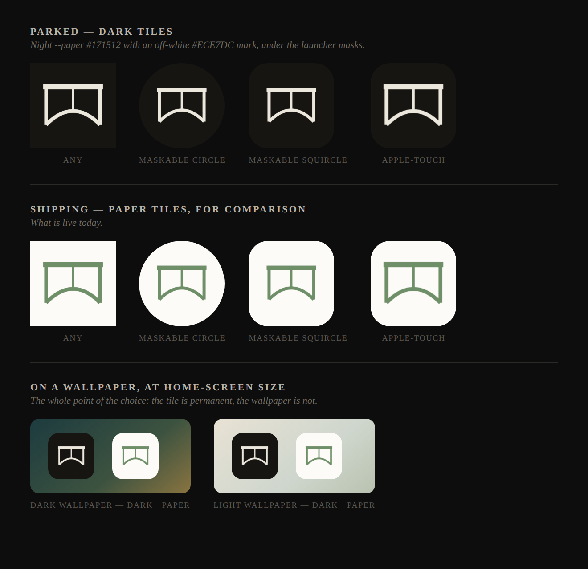

# Home-screen icons — the dark set (parked)

The charcoal alternative to the paper tiles that ship in
[`web/public/`](../../../web/public/). **Nothing serves these** — they are here so the
choice can be re-made later without re-deriving it. Drawn by
[`scripts/app-icons.mjs`](../../../scripts/app-icons.mjs) on the night palette: the app's
own night `--paper` (`#171512`) with an off-white `--ink` (`#ECE7DC`) mark, which is the
same pair the tab favicon swaps to in dark mode.



| File | Size | Manifest purpose |
| --- | --- | --- |
| `icon-192.png` | 192×192 | `any` |
| `icon-512.png` | 512×512 | `any` |
| `icon-maskable-192.png` | 192×192 | `maskable` |
| `icon-maskable-512.png` | 512×512 | `maskable` |
| `apple-touch-icon.png` | 180×180 | — (iOS reads it from a `<link>`) |
| `preview.png` | — | The contact sheet above; not an icon |

## Why this is a park and not a toggle

A launcher tile **cannot follow the OS theme**. There is no `color_scheme` on a manifest
icon — it is an [unshipped w3c proposal](https://github.com/w3c/manifest/issues/975) — and
Chrome rasterises WebAPK tiles at install time regardless. So this is not a dark-mode
variant of the shipping icon; it is a *different permanent icon*, for everyone, on every
wallpaper. That is why it is a brand decision rather than a theming one, and why it is
parked rather than wired to a switch. The bottom row of the preview is the actual trade:
the paper tile carries further on a dark wallpaper, the charcoal one on a light.

The tab favicon is the opposite case and already does follow the OS — see
*"The favicon has a dark mode; the home-screen tiles cannot"* in
[`CONTRIBUTING.md`](../../../CONTRIBUTING.md).

## Promoting them

```bash
node scripts/app-icons.mjs --dark web/public   # redraw straight over the shipping set
npm test                                       # the drift guards should stay green
git add web/public && git commit
```

Three things make that the whole job:

- **The filenames are identical**, so `web/public/site.webmanifest`, `web/index.html`,
  `web/src/appIcons.test.ts` and `scripts/cloudflare.mjs`'s `STATIC_FILES` all need no
  edit. The next deploy's `--purge` compares origin bytes, finds the five tiles changed
  and drops exactly those from the edge.
- **This directory is a preview, not the source.** Promotion re-draws from
  `site.webmanifest`, so an archive gone stale against a newly added size cannot ship a
  short set — worst case the preview above is out of date. Refresh it with
  `node scripts/app-icons.mjs --dark`.
- **Two things would still be worth a thought.** `web/index.html`'s
  `<meta name="theme-color">` and the manifest's `theme_color`/`background_color` are the
  paper `#fcfbf8`; they paint browser chrome and the standalone launch screen, not the
  icon, so they are a separate call. And the mark is off-white here rather than the night
  verdigris `#8cab84` — one literal in `PALETTES.dark`, if the green should survive.
